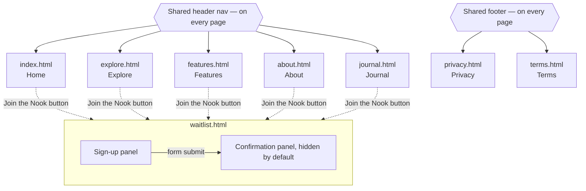
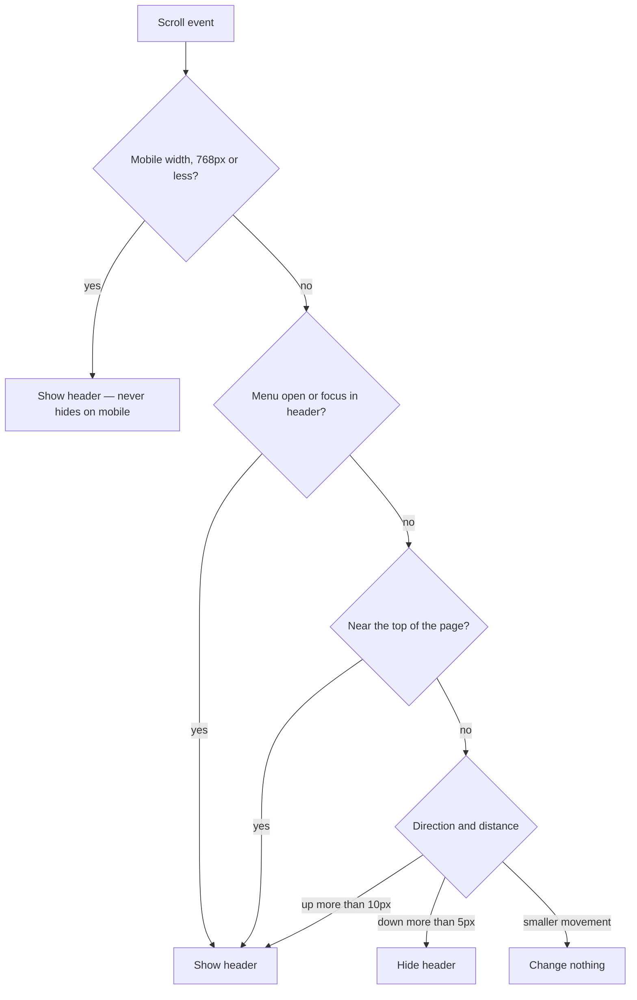
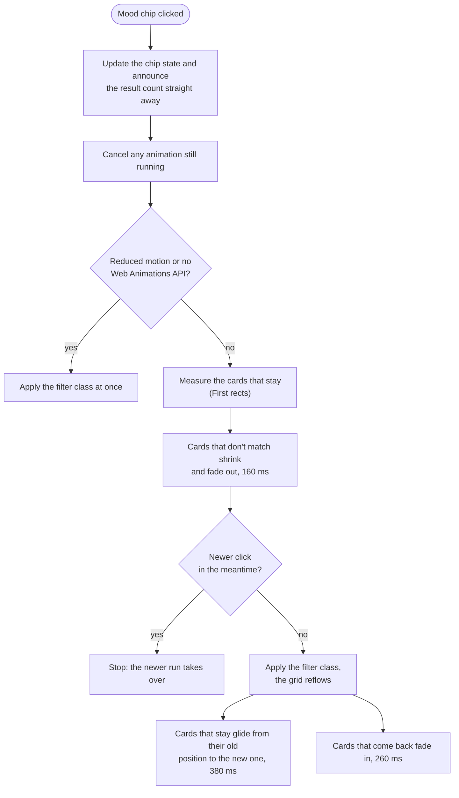

# Book Nook — Final project

Hand-coded marketing site for Book Nook, a privacy-focused reading tracker with anonymous profiles,
half-star ratings, genre stats and mood-based discovery. Plain HTML, CSS and vanilla JavaScript —
no framework and no build step. Built in stages across PEC 4 (HTML and CSS), PEC 5 (JavaScript) and
a six-phase final audit, and deployed on Netlify.

- **Live site:** https://nicolle-booknook.netlify.app/
- **Repository:** https://github.com/nicolledardon/book-nook-website


## FIGMA
https://www.figma.com/design/C8CzTyhKqB1bXOBC3PZxYd/book-nook-website?node-id=117-599&t=c5oMHRM4X3DnWiP2-1

## Project structure

```
book_nook_website/
├── index.html · explore.html · features.html · waitlist.html
├── about.html · journal.html · privacy.html · terms.html
├── css/
│   ├── variables.css    design tokens: colour, type, spacing, motion durations
│   ├── base.css         reset, base typography, view transitions, reduced-motion rules
│   ├── components.css   buttons, cards, chips, tabs, Feature mockups
│   └── layout.css       page sections, grids, colour bands, shelf strip, media queries
├── js/main.js           one file, one init*() function per interaction
├── assets/              covers (WebP + JPG, -sm / -lg), icons, favicons, og-image.png
└── _headers             Netlify cache rules
```

## Pages built

- `index.html` — Home
- `explore.html` — Explore / Discover
- `features.html` — Features
- `waitlist.html` — Waitlist sign-up (includes the confirmation state — see Deviations below)
- `about.html` — About Us
- `journal.html` — Journal / Blog
- `privacy.html` — Privacy, linked from the shared footer
- `terms.html` — Terms, linked from the shared footer

## Navigation



Every page shares one header with links to all five top-level pages and one footer with links to
Privacy and Terms (so the graph above uses a single node for each rather than drawing every
page-to-page edge). `waitlist.html` is reached from every page via the "Join the Nook" button and
is the only page with internal state: the confirmation panel exists in the same document, hidden
until JavaScript swaps it in on form submit — see Deviations below for why, and the Diagrams
section for the full validation flow.

## JavaScript interactions

Thirteen `init*()` functions in `js/main.js` — the brief requires at least three. The first six
were built for PEC 5 and are described first; the rest came with the final audit (see "Added in
the final audit" below). Each function checks that its elements exist and returns immediately if
they don't, so every function runs safely on every page without throwing console errors on pages
that don't have its markup. Every event listener is a named `handleXxx` function.

### 1. Mobile hamburger nav
**What:** opens/closes the mobile nav menu. **How:** `initMobileNav()` toggles an `is-nav-open`
class on `<body>` and flips `aria-expanded` on the toggle button. Visibility is driven entirely by
CSS (`body.is-nav-open .nav__links`), not an inline style. On phones the closed menu is
`opacity: 0; visibility: hidden` (not `display: none`), so opening it fades and slides. **Where:** every page, ≤768px widths.

### 2. Header hide-on-scroll (desktop only)
**What:** the header slides up out of view on scroll-down and reappears on scroll-up, above 768px
only — mobile stays sticky but never hides. **How:** `initHeaderScroll()` tracks scroll position
on a `passive` listener batched with `requestAnimationFrame`, and shows the header whenever the
viewport is mobile-width, the mobile menu is open, keyboard focus is inside the header, or the
page is near the top — otherwise it hides after 5px of downward movement and shows again after
10px of upward movement (the different thresholds stop trackpad jitter from flickering it). On
`features.html` it also docks the sticky anchor nav in step with the header (`.is-docked`), so no
gap opens where the header used to be. **Where:** every page (the header itself); the anchor-nav
docking only applies on `features.html`.

### 3. Waitlist form validation + confirmation
**What:** client-side email validation with inline errors, then a swap to a confirmation state
with a generated queue number. **How:** `initWaitlistForm()` intercepts submit, trims the value,
checks for empty vs. invalid-format, sets `aria-invalid` plus a visible `aria-live="polite"` error
message, and re-validates on every keystroke once the first attempt has failed (so the error
clears the moment it's fixed). On success it generates one random number that drives both the
queue badge and the ticket code, swaps the `hidden` sign-up/confirmation panels, moves focus to
the confirmation heading, and disables the submit button so it can't be submitted twice. The
ticket then "prints" in: a `clip-path` keyframe animation (`.is-printing`) reveals it from the top
while `printTicket()` counts the queue number up from 0 over about 1.1 s with
`requestAnimationFrame`. A screen-reader-only label carries the final number at once, so nobody
hears a half-way count, and `drawBarcode()` builds the barcode as one SVG `<rect>` per bar from a
small seeded random generator, so the same queue number always draws the same barcode. With reduced
motion the final number appears straight away and nothing animates. **Where:** `waitlist.html`. See
the Diagrams section for the full flow.

### 4. Explore mood-based Browse filter
**What:** clicking a mood chip shows only the books tagged with that mood; clicking the already-
selected chip again clears the filter and shows all books. **How:** `initMoodFilter()`,
`applyMoodFilter()`, and `clearMoodFilter()` put **one class on the grid** (`.book-row--mood-cozy`)
through a reusable `setFilterClass(container, prefix, value)` helper, and CSS hides the cards
whose `data-moods` doesn't contain that word (container pattern, see "FILTER MODIFIERS" in
`layout.css`). They also update the chips' `is-selected` class and `aria-pressed` through
`setSelectedChip()`, and announce the result count through an `aria-live` region via
`announce()` (the same text is shown on screen as a status line under the chips, e.g. "Showing 4
books for Cozy"). Cozy is filtered on page load to match the chip that ships pre-selected in the
HTML. The filtering is animated with the FLIP technique and the Web Animations API: cards that
don't match shrink and fade out, the class is applied so the grid reflows, the cards that stay
glide from their old position to the new one, and cards that come back fade in. A newer click
cancels whatever is still running, and reduced motion skips the animation entirely. **Where:**
`explore.html`. See the Diagrams section for the sequence.

### 5. Features anchor navigation
**What:** scrolling to (or clicking a link to) one of the four feature sections highlights its
matching nav button. **How:** `initAnchorNav()` uses an `IntersectionObserver` with a center-
crossing `rootMargin` (`-40% 0px -40% 0px`) so a section only counts as "current" once it crosses
near the middle of the viewport, not the instant its edge appears — toggling `is-active` and
`aria-current="location"` on the matching button. Clicking a button also marks it active
immediately, rather than waiting for the smooth-scroll to finish and the observer to catch up.
`scroll-behavior: smooth` plus a `scroll-margin-top` (`--header-height`) on each block keep anchor
jumps clear of the sticky header. **Where:** `features.html`.

### 6. Journal category filter
**What:** five toggle buttons (All, Reading, Design, Privacy, Behind the Scenes) filter the post
grid to one category at a time. **How:** `initJournalFilter()` / `applyJournalFilter()` reuse the
*exact same* `setFilterClass()`, `countMatches()`, and `announce()` functions written for the
mood filter above, swapping in `category` as the attribute instead of `moods` — this is the
actual code reuse the brief calls for, not just similarly-shaped new code. The grid gets
`.post-grid__list--category-design` and so on; "All" simply clears the class, since no post
carries `data-category="all"`. The bar is a real ARIA tabs widget: `role="tablist"` / `role="tab"`,
`aria-selected`, roving `tabindex`, Left/Right (wrapping), Home and End keys with automatic
activation (`setSelectedTab()` is the tabs counterpart of `setSelectedChip()`). The active "pill"
slides between tabs: `movePill()` measures the selected tab and sets `--pill-x` / `--pill-width`
on the bar, CSS does the sliding, and it re-measures on resize and once the web fonts have loaded.
**Where:** `journal.html`.

### Added in the final audit

The first six interactions were built for PEC 5. The final audit added the seven below. Each is an
enhancement: the page stays complete and readable without it, and every one is skipped or reduced
under `prefers-reduced-motion`.

### 7. FAQ accordion
**What:** the About page's questions open and close, one at a time. **How:** `initFaqAccordion()`
flips `aria-expanded` on the question button and an `.is-open` class on its item, closing whichever
other item was open. CSS animates the answer's height with `grid-template-rows: 0fr → 1fr`, so
JavaScript never sets a style. **Where:** `about.html`.

### 8. Hero headline reveal
**What:** the Home headline's words rise in one after another, then an SVG underline draws itself
beneath the accent phrase. **How:** `initHeroHeadline()` wraps each word in `.intro__word` with a
`--word-index` for CSS to stagger (spaces stay plain text, so wrapping and screen-reader output are
unchanged). The underline is an SVG path with `pathLength="1"`, drawn by animating its dash offset.
**Where:** `index.html`.

### 9. Scroll reveal
**What:** sections that start below the fold fade and slide up as they scroll into view, with
their children staggered. **How:** `initScrollReveal()` only touches sections below the fold, so
nothing visible on load is ever hidden (no flash, no hit to the largest-contentful-paint time). It
tags them `.reveal` and their children, or list items, `.reveal-item` with an `--i` index; one
`IntersectionObserver` adds `.is-revealed`, and 1.4 s later the helper classes are removed again.
Only `opacity` and `translate` animate. **Where:** every page.

### 10. Book card tilt and glare
**What:** with a mouse, the book card under the pointer tilts toward it (up to 8°) and catches a
moving highlight. **How:** `initCardTilt()` uses one delegated pair of pointer listeners per book
row and sets `--tilt-x`, `--tilt-y`, `--glare-x` and `--glare-y` on the active card (`.is-tilting`);
CSS does the rest. Skipped on touch screens. **Where:** Home and Explore.

### 11. Genre donut chart
**What:** the Features page's genre chart draws itself in. **How:** `initGenreDonut()` reads each
percentage from the legend and sets the matching SVG segment's length and start (`pathLength="100"`
plus `stroke-dasharray`), so the chart can never disagree with the numbers beside it. When the
panel is at least half on screen, `.is-drawn` lets the segments grow one after another. Without
JavaScript the CSS defaults draw the same chart in full. **Where:** `features.html`.

### 12. Half-star rater
**What:** a 0.5–5 star rating control. **How:** ten native radio inputs form the group, so arrow
keys work for free; `initHalfStarRater()` only paints the stars (`--fill` per star), previews the
value on hover, updates the number, announces "Rated 3.5 out of 5 stars" through a live region and
plays a small sparkle on the chosen star. **Where:** `features.html`.

### 13. Anonymous alias shuffle
**What:** a "shuffle" button on the profile mockup generates a new example alias and avatar.
**How:** `initAliasShuffle()` joins a random adjective and noun, hashes the alias into a seed and
uses a small seeded generator to fill a mirrored 5×5 SVG avatar (the same alias always gives the
same avatar), then announces the new alias. The button ships `hidden` and is shown by the script, so
it never appears without JavaScript. It is illustrative only — nothing is stored or sent.
**Where:** `features.html`.

### Page transitions (CSS only)
`@view-transition { navigation: auto }` in `base.css` crossfades between pages while the header
keeps its own transition name (`site-header`) and stays put. Browsers without support just
navigate normally.

### Motion rules
- Movement is limited to `transform` / `translate`, `opacity`, `clip-path` and SVG stroke
  properties; hover states transition colours. The one transition that affects layout is the FAQ's
  `grid-template-rows`, because a height can't be transitioned to `auto`.
- Transitions sit on the element's base state (never `transition: all`), so they play in both
  directions.
- Durations are `--duration-*` tokens, zeroed by `prefers-reduced-motion`; JavaScript effects call
  `prefersReducedMotion()` before starting.
- Everything that changes information is also announced to screen readers and works from the
  keyboard.

## Diagrams

### Waitlist form validation flow

```mermaid
flowchart TD
    Start([User submits the form]) --> Trim[Trim whitespace from the email field]
    Trim --> Empty{Field empty?}
    Empty -- yes --> ErrEmpty["Show error: 'Please enter your email'<br/>aria-invalid=true"]
    Empty -- no --> Format{Valid email format?}
    Format -- no --> ErrFormat["Show error: 'That doesn't look like<br/>an email address'<br/>aria-invalid=true"]
    Format -- yes --> Gen[Generate one random queue number]
    ErrEmpty --> Edit[User edits the field]
    ErrFormat --> Edit
    Edit --> Live{Re-validate on every keystroke<br/>after the first failed attempt}
    Live -- still invalid --> Edit
    Live -- now valid --> Gen
    Gen --> Fill[Write the number into both the<br/>queue badge and the ticket code]
    Fill --> Swap[Hide sign-up panel,<br/>show confirmation panel]
    Swap --> Focus[Scroll to top, move focus to<br/>"You're on the list!" heading]
    Focus --> Disable[Disable the submit button]
```

### Header hide/show logic (desktop only)



On `features.html` only, hiding/showing the header also toggles `.is-docked` on the sticky anchor
nav, sliding it up by the header's own height so it closes the gap left behind instead of
floating with empty space above it.

### Mood filter animation (FLIP)



FLIP stands for First, Last, Invert, Play: measure where a card is, let the layout change, move the
card back to where it was with a `transform`, then animate that transform away. The cards never
animate `top` or `left`.

## PEC 4 corrections completed in PEC 5

PEC 4 left several blocks flagged as pending. All are now resolved:

- **Confirmation panel was already visible on page load** — `.confirmation-panel` had
  `display: flex` in `layout.css`, which beat the browser's built-in `[hidden] { display: none }`
  rule on specificity terms. Fixed with `.confirmation-panel[hidden] { display: none; }` — the
  same specificity bug and fix later turned up in `.signup__panel` and `.book-card` too.
- **Header wasn't sticky on mobile** — the mobile media query set `header { position: relative }`,
  which would have made hide-on-scroll do nothing on phones. Fixed alongside the header hide/show
  feature; mobile is now sticky but never hides.
- **Mood filter had too few books** — 4 cards for 5 moods meant 0–1 results per mood. Grown to 9
  cards with full mood coverage (every mood returns 2–4 books).
- **Journal was essentially empty** — `.post-grid` had no content. 6 real post cards were built,
  plus the missing "All" and "Behind the Scenes" tabs (the original build only had 3 of the 5
  categories wired up).
- **Missing design tokens and component styles** — `--color-error` and `--color-success` were
  added (checked for 4.5:1 contrast against both Apricot and Bone), and `.category-tabs__tab` / `.post-card` /
  `.category-tabs` had no styles at all before this PEC.

## Final audit (Phases 1–6)

After PEC 5 the whole site was audited against the final-project criteria and fixed in six
phases. Each deviation from the Figma that came out of it is logged in the memoria.

### Phase 1 — HTML structure, links, SEO, form
- Waitlist form has `action` / `method`; footer links, book rows, highlight cards, post grid and
  social icons are real lists; header, footer and the Features anchor bar are labelled `<nav>`s.
- Every `<a>` and `<button>` has a `title`; social links open in a new tab with
  `rel="noreferrer noopener"`; current page marked with `aria-current="page"`.
- Star ratings are `role="img"` with an `aria-label`; book titles are `<h3>`; scripts use `defer`.

### Phase 2 — Responsive bugs and contrast
- Media queries ordered widest to narrowest (base/1025+ → 769–1024 → ≤768 → ≤480) so the
  narrowest block wins on phones; the Home highlights are one column on phones.
- One muted-text token, `#58534B` (4.6:1 on Apricot), replaces two colours that failed 4.5:1.
- `--radius-pill` token; Features anchor nav collapses to a dropdown bar on phones.

### Phase 3 — Images and SVG
- Covers re-exported as `-sm` / `-lg` WebP + JPG, used through `<picture>` with a
  `(max-width: 768px)` source; `width` / `height` on every image; lazy loading below the fold.
- One inline SVG sprite per page (`<symbol>` + `<use>`) for stars, menu, highlight, feature and
  social icons; the waitlist barcode is one SVG instead of 20 spans (its bars are now generated from the queue number).
- `_headers` gives Netlify long, immutable cache times for images (`/assets/*`) and makes CSS, JS and
  HTML revalidate on every visit (`max-age=0, must-revalidate`). Those files keep the same name when
  they change, so a long cache would keep serving old code after a deploy.

### Phase 4 — CSS cleanup, states, JavaScript
- **CSS:** no raw colours (`--color-surface-15` token added), no `#id` selectors, no `!important`;
  highest selector specificity is 0,4,0 (re-checked after Phase 6). `padding-top` + `padding-bottom` pairs became
  `padding-block`; duplicate rule blocks and a duplicated 1025px+ media query were removed.
- **BEM renames:** `.logo` → `.header__logo`, `.cta` → `.features-cta`, `.tab` →
  `.category-tabs__tab`, `.anchor-buttons` / `.anchor-button` → `.anchor-nav` / `.anchor-nav__link`,
  `.queue-badge` / `.barcode` / `.dashed-divider` → `.ticket__badge` / `.ticket__barcode` /
  `.ticket__divider`, and `.feature-block > div:first-child` → `.feature-block__media`.
- **Interaction states:** every link and button has hover, active and keyboard-focus styles, each
  with a transition on the base state (never `transition: all`). Header links draw an underline
  with `transform: scaleX`; the mobile menu and its overlay fade and slide.
- **Motion tokens:** `--duration-fast / base / slow`, zeroed by `prefers-reduced-motion`.
- **JavaScript:** every event listener is a named `handleXxx` function; the Explore and Journal
  filters set one class on the grid and CSS does the hiding.

### Phase 5 — Visual polish
- **Editorial type:** new type tokens for the Home hero headline (`--fs-display`, 40–72 px) and a
  wide footer wordmark (`--fs-wordmark`), in Crimson Pro; body copy stays in Roboto Flex.
- **Full-width colour bands:** content stays inside its 90rem container while the colour is
  painted outwards with `box-shadow: 0 0 0 100vmax var(--band-color)` and `clip-path: inset(0 -100vmax)`.
  A transparent `border-block` supplies the band's vertical padding (`--band-padding`). No wrapper
  elements, and no horizontal scrollbar. Used for Home's highlights and Explore's second shelf.
- **Shelf ledge:** a Chocolate Fondant strip under the last row of covers on book rows.
- **Solid header colour:** `--color-header-bg` replaces the translucent header so dark bands
  scrolling underneath don't wash out the nav links.
- **Brand details:** text selection and caret in the brand colours, and a slim Bone-tinted
  scrollbar on the scrolling tab bar.

### Phase 6 — Feature mockups and interactions
- **Coded mockups** on `features.html` replace the grey placeholders: half-star rater, genre donut
  with legend, anonymous profile with alias shuffle, and a recommendations list.
- **Interactions** listed under "Added in the final audit" in the JavaScript section, plus the
  waitlist ticket print with its generated barcode and the animated mood filter.
- **Page transitions** between documents with the View Transitions API.
- **Reduced motion:** every duration is a token that `prefers-reduced-motion` sets to `0s`, and the
  JavaScript effects check the same preference.

### Extras on the Home page
- **Hero book stack:** the intro became two columns on desktop, with three real covers fanned on
  the right (see Deviations).
- **Bookshelf strip:** a decorative row of book spines between the intro and the highlights,
  restored from the PEC 2 wireframe (see Deviations).

## Components

- **Book card** (`.book-card`) — cover, title, author, star rating. One shared component reused
  across Home's Popular Books row and all three Explore rows (Mood-based Browse results, Recent
  Releases, Popular Shelves) — matches the single "Book Row" / "Book Card" component in Figma,
  no size variants.
- **Feature block** (`.feature-block`) — Features page, four instances; each pairs its text with a
  coded mockup (`.mock`) in `.feature-block__media`.
- **Mood chip** (`.mood-chip`) — Explore's mood filter buttons, with an `.is-selected` state.
- **Tab** (`.category-tabs__tab`) — Journal's category filter, styled as one segmented pill bar
  (`.category-tabs`: a dark rounded bar with the active tab as a light pill inside it) rather than
  individual chip buttons, based on a reference Nicolle provided — see Deviations.
- **Post card** (`.post-card`) — Journal's blog listing: category, title, date. Mirrors
  `.book-card`'s surface/shadow/radius treatment, left-aligned instead of centered since it's text
  content, not a poster.
- **Mock panel** (`.mock`) — the shared Bone panel behind each coded Feature mockup on
  `features.html` (`.mock--genre` and its siblings), so the four mockups share one surface,
  radius and shadow.
- **FAQ item** (`.faq__item`) — About page accordion; one open at a time, answer height animated
  with `grid-template-rows`.
- **Shelf strip** (`.shelf`, `.shelf__book`, `.shelf__ledge`) — Home's decorative row of book
  spines. Each spine is a list item styled through custom properties (`--spine-bg`, `--spine-fg`,
  `--spine-h`, `--lean`) with colour modifiers (`--cocoa`, `--bone`, `--tan`, `--slate`).

## Deviations from the Figma design

### Waitlist confirmation is not a separate HTML file

In Figma, "Waitlist Sign-up" and "Waitlist Confirmation" are two separate full-page frames, each
with its own Header/Footer instance. In this build, both live inside a single file,
`waitlist.html`, as two sections (`.signup__panel` and `.confirmation-panel`) instead of two pages
(`waitlist.html` + `waitlist-confirm.html`).

**Reasoning:** the transition from sign-up to confirmation is driven by JavaScript (PEC 5): form
submission swaps which panel is visible, with the confirmation panel populated in real time (the
queue number). Keeping both states in one document means:

- No full page reload between submitting the form and seeing the confirmation — the interaction
  stays client-side, which is the whole point of building it as a JS-driven flow rather than a
  server round trip.
- The confirmation content (queue badge, barcode, ticket code: `.ticket__badge`, `.ticket__barcode`, `.ticket__code`) is generated and inserted by the
  same script that handles the form submission, without needing to pass state between two
  separate HTML documents (e.g. via query strings or localStorage) just to simulate one.
- One less page to keep the header/footer, styles, and script includes in sync across.

The tradeoff, noted honestly: this is a real structural deviation from the Figma page
architecture, not just a file-naming choice, since Figma specs these as two distinct pages.
Refreshing the confirmation page goes back to the sign-up form, and a new submit generates a new
queue number — expected behavior for a client-only demo with no backend, not a bug.

### `.user-shelves-cta` rebuilt to match Figma

The Explore page's "Build your own shelves" section was originally coded as a 3-card grid. Figma's
`user-shelves-cta` frame is not a card grid — it's a single CTA banner (heading, supporting text,
one primary button). The section has been rebuilt to match: `<h2>`, `<p>`, and one `<button>`.

### Book card markup unified

`explore.html` originally used three unrelated, ad-hoc classes for what should be the same
component (`.recent-release`, `.shelf-card`, `.user-shelf`), none of which matched the actual
Figma "Book Card" anatomy (cover, title, author, star rating). All book-row instances — Home's
Popular Books, and Explore's Mood-based Browse results, Recent Releases, and Popular Shelves — now
share one `.book-card` structure. Card counts per row were also corrected to match Figma's 4-card
"Book Row" component (Popular Shelves was previously coded as 8 cards across 2 rows; Mood-based
Browse was missing its results row entirely).

### Reduced motion (added in the final audit)

During PEC 5 a `prefers-reduced-motion` reset was skipped on purpose (27–28 Sept 2026). The final
audit reversed that: every transition now reads a `--duration-*` token, and a
`prefers-reduced-motion: reduce` block in `base.css` sets those tokens to `0s` and turns smooth
scrolling off. Tokens were used instead of a global `* { transition: none }` because overriding
class rules from `*` would need `!important`, which this project bans.

### Hamburger menu polish skipped

The PEC 5 plan included closing the mobile nav on the Escape key (with focus returning to the
toggle button) and auto-closing it on resize to desktop width. Both were dropped per Nicolle's
decision (27 Sept 2026); the hamburger menu from PEC 4 works as-is, just reorganized into
`initMobileNav()`.

### No "no results" empty state on either filter

Both the mood filter (5 moods across 9 books) and the Journal category filter (4 categories across
6 posts) guarantee every option returns at least one result, so the "no results match" empty state
described in `design.md` can never actually occur and wasn't built. If content is ever added or
removed such that a category could return zero results, that state would need adding.

### Journal post content is placeholder, not from Figma

The Journal page's Figma frame doesn't specify real post copy. The 6 post titles/categories/dates
in this build are placeholder content written to match the product's own feature set (genre
tracking, half-star ratings, anonymous profiles), not pulled from a design file.

### Journal tabs styled as a segmented pill bar, not individual chips

`.category-tabs` is one dark rounded bar with the active tab shown as a light pill inside it,
rather than a row of individually-backgrounded buttons like `.mood-chip`. This was built from a
reference screenshot Nicolle provided (a coworking-space site's tab control), not from Book Nook's
own Figma file — the shape/structure follows the reference, but the colors are Book Nook's own
tokens (`--color-dominant` for the bar, `--color-surface` for the active pill), not the
reference's literal brown/gold palette.

### Final-audit changes beyond the Figma

The final audit added or changed the following relative to the PEC 3 Figma. Each one is also
listed in the memoria.

| Change | What was built | Why |
| --- | --- | --- |
| Two-column Home hero | Text on the left; on the right three real covers fanned like a hand of cards (`.intro__stack`) that spread on hover. At 1024 px and below the hero is one column and the stack is hidden. | Fills the right half of the desktop hero. Purely decorative, so it is `aria-hidden` with empty `alt` text. |
| Bookshelf strip on Home | A decorative row of 22 book spines (real titles from "Popular right now", filler spines, two leaning books, a ledge) between the intro and the highlights. | The PEC 2 wireframe had a shelf there; the PEC 3 Figma dropped it. It brings that idea back. It is `aria-hidden` and uses the site palette only — Gold stays reserved for ratings. |
| Full-width colour bands | A Dress Blues band behind Home's four highlights and a soft Bone band behind Explore's second shelf. | Gives the long pages a rhythm. Bone text on Dress Blues is 11.74:1. |
| Shelf ledge under book rows | A Chocolate Fondant strip under the last row of covers (`.book-row::after`), hidden on phones and small tablets. | Makes the covers read as standing on a shelf; on narrow screens the cards stack into short rows and a ledge would look wrong. |
| Oversized footer wordmark | The footer's brand text runs wide across its first row (`--fs-wordmark`). | Editorial finish. |
| Solid header colour | `--color-header-bg: #E7CEB4`, which looks the same as Bone at 20% over Apricot. | The translucent header let dark bands show through when they scrolled underneath it, hurting the nav links' readability. |
| Coded Feature mockups | The grey placeholders on Features are now small working UIs: a half-star rater, a genre donut chart with legend, an anonymous profile with a shuffle button, and a recommendations list. | Shows each feature instead of describing it. All built from HTML, CSS and inline SVG — no extra images. |
| Real covers and icons | Placeholder boxes became real covers (`-sm` / `-lg`, WebP + JPG) and the icons became an inline SVG sprite. | Phase 3 image and SVG requirements. |
| Visible filter status | The mood filter shows "Showing N books for Cozy" under the chips. | Sighted users get the same result count that screen readers hear. |
| Ticket print and generated barcode | The confirmation ticket prints in with a counting queue number; the barcode is drawn from the queue number. | Replaces the static barcode and makes the confirmation feel like a result. |
| Single-colour social icons | Instagram, Pinterest and TikTok are all one light colour. | They stay visible on the dark footer. |
| Features anchor nav on phones | The four anchor buttons collapse into a dropdown bar at 768 px and below. | A row of four buttons is too wide for a phone. |
| Motion and page transitions | Scroll reveal, hero headline, card tilt, tab pill, FAQ accordion, donut draw-in, rater sparkle, animated mood filter and cross-page View Transitions. | The Figma is static. Everything is optional and switches off under `prefers-reduced-motion`. |
| Privacy and Terms pages | `privacy.html` and `terms.html`, linked from the shared footer. | So the footer's Privacy and Terms links open real pages. |

## CSS Methodology

This project uses **BEM** (Block\_\_Element--Modifier) for CSS class naming.

- **Block** — a standalone, reusable component: `.book-card`, `.feature-block`, `.highlight`,
  `.ticket`, `.mood-chip`, `.category-tabs`, `.post-card`. A hyphenated name (e.g. `.feature-block`,
  `.mood-browse`) is still a single block, not a block+element split — the hyphen there is just
  part of the block's own name.
- **Element** — a part of a block that has no standalone meaning outside it, written
  `.block__element`: `.book-card__cover`, `.highlight__icon`, `.highlight__title`,
  `.feature-block__media`, `.ticket__heading`, `.footer__links`, `.post-card__title`.
- **Modifier** — a variant of a block or element, written `.block--modifier` or
  `.block__element--modifier`: `.btn--primary`, `.feature-block--reverse`,
  `.highlight__icon--half-star`, `.header--hidden`.
- **State classes** — one deliberate exception to strict BEM: `.is-selected` (mood chip, journal
  tab), `.is-active` (anchor nav button), `.is-docked` (anchor nav, synced to the header hiding),
  and `.is-nav-open` (on `<body>`, mobile nav) all use the SUIT CSS `is-` prefix instead of a BEM
  modifier. The final audit added more of the same kind: `.is-open` (FAQ item), `.is-revealed`
  (scroll reveal), `.is-drawn` (donut), `.is-printing` (waitlist ticket), `.is-tilting` (book
  card), `.is-popping` (rater star), plus `.has-pill` (journal tab bar) and `.js-draw` (donut,
  before it draws). States like "currently open," "currently selected," or "currently docked"
  describe a temporary condition toggled by JS, not a permanent variant of the component, so a
  state class keeps that distinction visible in the markup and avoids implying the state is baked
  into the component the way a real modifier (`--reverse`, `--primary`, `--hidden`) is.
- **`.page-section`** is a layout utility class, not a BEM block — it's applied to every
  top-level `<main> > <section>` (and, on `features.html`, the promoted `<nav class="anchor-nav">`)
  across every page to give them a shared max-width/padding container.

Selectors were also audited to avoid unnecessary specificity and structural (type/combinator)
selectors that break the moment markup shifts: `header nav` → `.header__nav`,
`main > section` → `.page-section`, `.highlight > div:first-child` → `.highlight__icon`, and
similar — every element now targeted by a class that lives directly on it in the HTML, rather
than by its position in the DOM.

## Tech notes

- Plain CSS, not Sass — both are accepted per the brief; native CSS custom properties give the
  same token system without a build step.
- `box-sizing: border-box` set globally in `base.css`'s reset. Without it, an element's declared
  `width` covers content only — padding and border get added on top, so a bordered element
  renders larger than an unbordered one at the same declared width. This would break the button
  system directly: Secondary buttons have a 2px border that Primary and Tertiary don't, so under
  the default box model (`content-box`) Secondary buttons would render wider than Primary even
  though `design.md` specs them at the same size. `border-box` makes padding and border count
  inside the declared width instead, so all three button variants stay visually consistent.
- Rating stars are an inline SVG sprite, not image files. Each page that shows ratings carries a
  `<symbol>` for the full, half and empty star and draws them with
  `<svg class="star"><use href="#star-half"/></svg>`. The Gold fill and dark outline are baked into
  the symbols, which matches the Figma export exactly; the trade-off, noted honestly, is that if
  Gold or the outline colour ever changes in `variables.css`, the symbols have to be edited too, not
  just a token. The original star files and the other source icons are still in `assets/icons/`,
  but no page loads them any more — the sprite replaced them in Phase 3.
- `setFilterClass(container, prefix, value)`, `countMatches(...)`, `setSelectedChip(chipList, selectedChip)`
  and `announce(liveRegion, message)` in `js/main.js` are written once (for the Explore mood filter)
  and reused as-is (not copy-pasted or adapted) by the Journal category filter, just parameterized
  by a different prefix and attribute (`moods` vs. `category`) — one implementation, two features.
- `--header-height` in `variables.css` is a hand-computed approximation (90px), not a live
  measurement: the header's vertical padding is a constant `2 × 1.5rem` at every breakpoint, but
  its tallest content row differs (~88px on desktop/tablet with the "Join the Nook" button vs.
  ~80px on mobile with the hamburger icon). The variable rounds up to the larger case, so mobile
  gets a few harmless extra pixels of `scroll-margin-top` rather than any risk of a heading
  landing under the sticky header.
- `.post-grid` and `.category-tabs` both had to be fixed for overflow at 320px after they were
  first built: `.post-grid` uses `minmax(min(18.75rem, 100%), 1fr)` instead of a bare `18.75rem`
  so its column self-adapts to full-width on narrow screens without a breakpoint override, and
  `.category-tabs` caps at `max-width: 100%` with `overflow-x: auto` so the pill bar scrolls
  internally instead of pushing the whole page wide.
- Stylesheets load in the order `variables.css` → `base.css` → `components.css` → `layout.css`.
  Tokens come first, then the reset and base rules; layout sits last so its section-level
  overrides (colour bands, responsive media queries) win over the component defaults without
  needing higher specificity.
- The shelf spines use `writing-mode: vertical-rl`, which changes what "inline" means. Logical
  margins (`margin-inline-*`) pushed the leaning books into their neighbours, so those margins are
  physical `margin-left` / `margin-right`.
- Enhancements degrade quietly. The genre donut is fully drawn by its CSS defaults if JavaScript
  doesn't run; the alias shuffle button ships `hidden` and is shown by the script; cross-document
  View Transitions only apply in browsers that support them (others navigate normally); the shelf
  strip uses `overflow-x: clip` rather than `hidden`, so it doesn't turn into a scroll container.
- Testing: scripted Chromium runs (Playwright) between 320 and 1440 px checking horizontal
  overflow, console errors and every interaction listed above, plus a hands-on check on a phone.

## Credits

- **Menu icon** — "Created by Miguel C Balandrano, from the Noun Project". The credit text that was
  baked into `assets/icons/menu.svg` is not part of the inline SVG sprite, so it is credited here
  instead.
- **Social icons** — the Pinterest and TikTok shapes come from the official brand files supplied for
  the project, recoloured to a single light colour so they stay visible on the dark footer. The
  Instagram glyph is redrawn as an outline to match them.
- **Book covers** — shown for illustration only; they belong to their publishers and authors.
- **Fonts** — Crimson Pro (headings) and Roboto Flex (body text), loaded from Google Fonts; both are
  released under the SIL Open Font License.
