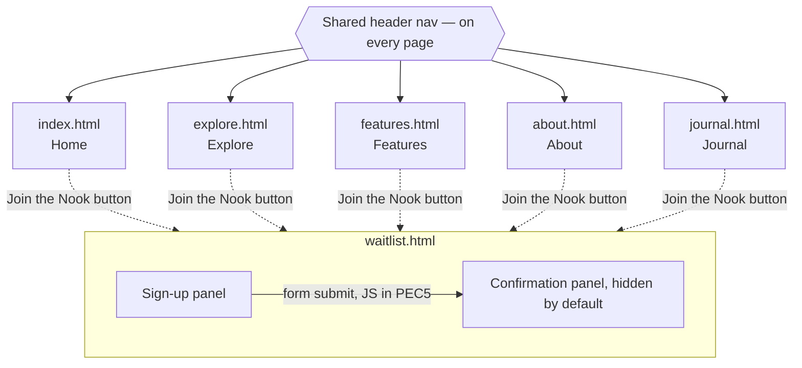

# Book Nook — PEC 4 (Maquetación con HTML, CSS y JS)

Hand-coded build of the Book Nook site 

## FIGMA
https://www.figma.com/design/C8CzTyhKqB1bXOBC3PZxYd/book-nook-website?node-id=117-599&t=c5oMHRM4X3DnWiP2-1

## Pages built

- `index.html` — Home
- `explore.html` — Explore / Discover
- `features.html` — Features
- `waitlist.html` — Waitlist sign-up (includes the confirmation state — see Deviations below)
- `about.html` — About Us
- `journal.html` — Journal / Blog

## Navigation

Every page shares one header with links to all five top-level pages (so the graph above uses a
single nav node rather than drawing all 20 page-to-page edges). `waitlist.html` is reached from
every page via the "Join the Nook" button and is the only page with internal state: the
confirmation panel exists in the same document, hidden until PEC5's JavaScript swaps it in on
form submit — see Deviations below for why.

## Components

- **Book card** (`.book-card`) — cover, title, author, star rating. One shared component reused
  across Home's Popular Books row and all three Explore rows (Mood-based Browse results, Recent
  Releases, Popular Shelves) — matches the single "Book Row" / "Book Card" component in Figma,
  no size variants.
- **Feature block** (`.feature-block`) — Features page, four instances.
- _(Styling pass and full component documentation to follow — CSS not yet built.)_

## Deviations from the Figma design

### Waitlist confirmation is not a separate HTML file

In Figma, "Waitlist Sign-up" and "Waitlist Confirmation" are two separate full-page frames, each
with its own Header/Footer instance. In this build, both live inside a single file,
`waitlist.html`, as two sections (`.signup__panel` and `.confirmation-panel`) instead of two pages
(`waitlist.html` + `waitlist-confirm.html`).

**Reasoning:** the transition from sign-up to confirmation is going to be driven by JavaScript in
PEC 5 (form submission swaps which panel is visible, with the confirmation panel populated in
real time — e.g. the queue number). Keeping both states in one document means:

- No full page reload between submitting the form and seeing the confirmation — the interaction
  stays client-side, which is the whole point of building it as a JS-driven flow rather than a
  server round trip.
- The confirmation content (queue badge, barcode, ticket code) can be generated and inserted by
  the same script that handles the form submission, without needing to pass state between two
  separate HTML documents (e.g. via query strings or localStorage) just to simulate one.
- One less page to keep the header/footer, styles, and script includes in sync across.

The tradeoff, noted honestly: this is a real structural deviation from the Figma page
architecture, not just a file-naming choice, since Figma specs these as two distinct pages. A
PEC5 comment flags the exact spot in `waitlist.html` where the JS will toggle between the two
panels.

### `.user-shelves-cta` rebuilt to match Figma

The Explore page's "Build your own shelves" section was originally coded as a 3-card grid. Figma's
`user-shelves-cta` frame is not a card grid — it's a single CTA banner (heading, supporting text,
one primary button). The section has been rebuilt to match: `<h2>`, `
`, and one `<button>`.

### Book card markup unified

`explore.html` originally used three unrelated, ad-hoc classes for what should be the same
component (`.recent-release`, `.shelf-card`, `.user-shelf`), none of which matched the actual
Figma "Book Card" anatomy (cover, title, author, star rating). All book-row instances — Home's
Popular Books, and Explore's Mood-based Browse results, Recent Releases, and Popular Shelves — now
share one `.book-card` structure. Card counts per row were also corrected to match Figma's 4-card
"Book Row" component (Popular Shelves was previously coded as 8 cards across 2 rows; Mood-based
Browse was missing its results row entirely). Mood chips were reduced from 9 to Figma's actual 5
(Cozy, Thrilling, Heartfelt, Mind-bending, Uplifting).

## CSS Methodology

This project uses **BEM** (Block\_\_Element--Modifier) for CSS class naming.

- **Block** — a standalone, reusable component: `.book-card`, `.feature-block`, `.highlight`,
  `.ticket`, `.mood-chip`. A hyphenated name (e.g. `.feature-block`, `.mood-browse`) is still a
  single block, not a block+element split — the hyphen there is just part of the block's own
  name.
- **Element** — a part of a block that has no standalone meaning outside it, written
  `.block__element`: `.book-card__cover`, `.highlight__icon`, `.highlight__title`,
  `.feature-block__media`, `.ticket__heading`, `.footer__links`.
- **Modifier** — a variant of a block or element, written `.block--modifier` or
  `.block__element--modifier`: `.btn--primary`, `.feature-block--reverse`,
  `.highlight__icon--half-star`.
- **State classes** — one deliberate exception to strict BEM: `.is-selected` (mood chip) and
  `.is-nav-open` (on `<body>`, mobile nav) use the SUIT CSS `is-` prefix instead of a BEM
  modifier. States like "currently open" or "currently selected" describe a temporary condition
  toggled by JS, not a permanent variant of the component, so a state class keeps that
  distinction visible in the markup and avoids implying the state is baked into the component the
  way a real modifier (`--reverse`, `--primary`) is.
- **`.page-section`** is a layout utility class, not a BEM block — it's applied to every
  top-level `<main> > <section>` across all six pages to give them a shared max-width/padding
  container, replacing what used to be a `main > section` combinator selector so the same rule
  now works whether or not a section is main's direct child.

Selectors were also audited to avoid unnecessary specificity and structural (type/combinator)
selectors that break the moment markup shifts: `header nav` → `.header__nav`,
`main > section` → `.page-section`, `.highlight > div:first-child` → `.highlight__icon`, and
similar — every element now targeted by a class that lives directly on it in the HTML, rather
than by its position in the DOM.

## Tech notes

- Plain CSS, not Sass — both are accepted per the brief; native CSS custom properties give the
  same token system without a build step.
- `box-sizing: border-box` set globally in `base.css`'s reset. Without it, an element's declared
  `width` covers content only — padding and border get added on top, so a bordered element
  renders larger than an unbordered one at the same declared width. This would break the button
  system directly: Secondary buttons have a 2px border that Primary and Tertiary don't, so under
  the default box model (`content-box`) Secondary buttons would render wider than Primary even
  though `design.md` specs them at the same size. `border-box` makes padding and border count
  inside the declared width instead, so all three button variants stay visually consistent.
- Book rating stars are three separate files in `assets/icons/` — `star.svg` (full, gold fill +
  dark outline), `half_star.svg` (gold fill clipped to the left half via an internal
  `clip-path`, same outline over the whole shape), and `empty_star.svg` (outline only, no fill).
  Each `.star--full` / `.star--half` / `.star--empty` class just swaps `background-image` to the
  matching file — no CSS color trick needed, since the compositing (including the half-fill) is
  already baked into the SVGs themselves. This was a deliberate change from an earlier plan (one
  shared icon recolored via `currentColor` from `variables.css`): these three files are exported
  straight from Figma, so using them as-is matches Figma exactly rather than approximating it.
  The trade-off, noted honestly: colors are now hardcoded inside the SVG files rather than
  flowing from `variables.css` — if Gold or the outline gray ever changes there, these three
  files need re-exporting to match, not just a token edit.
