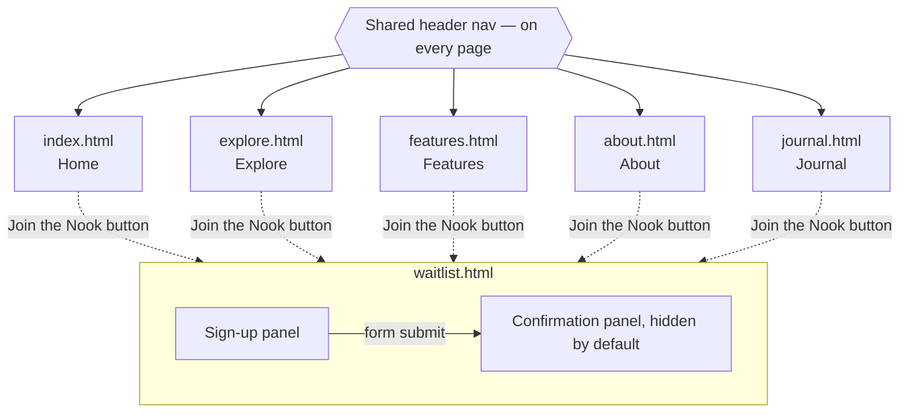
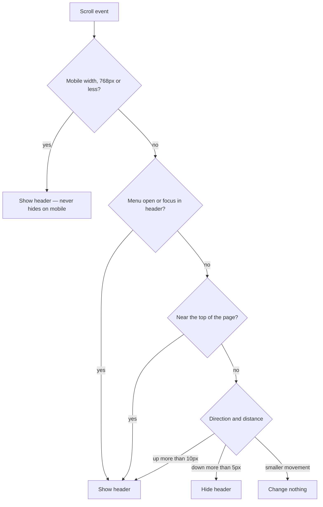

# Book Nook — PEC 4 & PEC 5 (Maquetación + Interacción con JavaScript)

Hand-coded build of the Book Nook site

## FIGMA
https://www.figma.com/design/C8CzTyhKqB1bXOBC3PZxYd/book-nook-website?node-id=117-599&t=c5oMHRM4X3DnWiP2-1

## Pages built

- `index.html` — Home
- `explore.html` — Explore / Discover
- `features.html` — Features
- `waitlist.html` — Waitlist sign-up (includes the confirmation state — see Deviations below)
- `about.html` — About Us
- `journal.html` — Journal / Blog

## Navigation



Every page shares one header with links to all five top-level pages (so the graph above uses a
single nav node rather than drawing all 20 page-to-page edges). `waitlist.html` is reached from
every page via the "Join the Nook" button and is the only page with internal state: the
confirmation panel exists in the same document, hidden until JavaScript swaps it in on form
submit — see Deviations below for why, and the Diagrams section for the full validation flow.

## JavaScript interactions (PEC 5)

Six interactions total — the brief requires at least three. Each `init*()` function in
`js/main.js` checks that its elements exist and returns immediately if they don't, so every
function runs safely on every page without throwing console errors on pages that don't have its
markup.

### 1. Mobile hamburger nav
**What:** opens/closes the mobile nav menu. **How:** `initMobileNav()` toggles an `is-nav-open`
class on `<body>` and flips `aria-expanded` on the toggle button. Visibility is driven entirely by
CSS (`body.is-nav-open .nav__links`), not an inline style, so it never fights the mobile
stylesheet's own `display: none` rule on specificity terms. **Where:** every page, ≤768px widths.

### 2. Header hide-on-scroll (desktop only)
**What:** the header slides up out of view on scroll-down and reappears on scroll-up, above 768px
only — mobile stays sticky but never hides. **How:** `initHeaderScroll()` tracks scroll position
on a `passive` listener batched with `requestAnimationFrame`, and shows the header whenever the
viewport is mobile-width, the mobile menu is open, keyboard focus is inside the header, or the
page is near the top — otherwise it hides after 5px of downward movement and shows again after
10px of upward movement (the different thresholds stop trackpad jitter from flickering it). On
`features.html` it also docks the sticky anchor nav in step with the header (`.is-docked`), so no
gap opens where the header used to be. **Where:** every page (the header itself); the anchor-nav
docking only applies on `features.html`.

### 3. Waitlist form validation + confirmation
**What:** client-side email validation with inline errors, then a swap to a confirmation state
with a generated queue number. **How:** `initWaitlistForm()` intercepts submit, trims the value,
checks for empty vs. invalid-format, sets `aria-invalid` plus a visible `aria-live="polite"` error
message, and re-validates on every keystroke once the first attempt has failed (so the error
clears the moment it's fixed). On success it generates one random number that drives both the
queue badge and the ticket code, swaps the `hidden` sign-up/confirmation panels, moves focus to
the confirmation heading, and disables the submit button so it can't be submitted twice. **Where:**
`waitlist.html`. See the Diagrams section for the full flow.

### 4. Explore mood-based Browse filter
**What:** clicking a mood chip shows only the books tagged with that mood; clicking the already-
selected chip again clears the filter and shows all books. **How:** `initMoodFilter()`,
`applyMoodFilter()`, and `clearMoodFilter()` toggle each card's native `hidden` attribute through
a reusable `filterCards(cardList, datasetKey, value)` helper, update the chips' `is-selected`
class and `aria-pressed` through `setSelectedChip()`, and announce the result count through an
`aria-live` region via `announce()`. Cozy is filtered on page load to match the chip that ships
pre-selected in the HTML. **Where:** `explore.html`.

### 5. Features anchor navigation
**What:** scrolling to (or clicking a link to) one of the four feature sections highlights its
matching nav button. **How:** `initAnchorNav()` uses an `IntersectionObserver` with a center-
crossing `rootMargin` (`-40% 0px -40% 0px`) so a section only counts as "current" once it crosses
near the middle of the viewport, not the instant its edge appears — toggling `is-active` and
`aria-current="location"` on the matching button. Clicking a button also marks it active
immediately, rather than waiting for the smooth-scroll to finish and the observer to catch up.
`scroll-behavior: smooth` plus a `scroll-margin-top` (`--header-height`) on each block keep anchor
jumps clear of the sticky header. **Where:** `features.html`.

### 6. Journal category filter
**What:** five toggle buttons (All, Reading, Design, Privacy, Behind the Scenes) filter the post
grid to one category at a time. **How:** `initJournalFilter()` / `applyJournalFilter()` reuse the
*exact same* `filterCards()`, `setSelectedChip()`, and `announce()` functions written for the
mood filter above, swapping in `category` as the dataset key instead of `moods` — this is the
actual code reuse the brief calls for, not just similarly-shaped new code. "All" is handled as a
direct show-everything branch, since no post carries `data-category="all"` for `filterCards()` to
match against. **Where:** `journal.html`.

## Diagrams

### Waitlist form validation flow

```mermaid
flowchart TD
    Start([User submits the form]) --> Trim[Trim whitespace from the email field]
    Trim --> Empty{Field empty?}
    Empty -- yes --> ErrEmpty["Show error: 'Please enter your email'<br/>aria-invalid=true"]
    Empty -- no --> Format{Valid email format?}
    Format -- no --> ErrFormat["Show error: 'That doesn't look like<br/>an email address'<br/>aria-invalid=true"]
    Format -- yes --> Gen[Generate one random queue number]
    ErrEmpty --> Edit[User edits the field]
    ErrFormat --> Edit
    Edit --> Live{Re-validate on every keystroke<br/>after the first failed attempt}
    Live -- still invalid --> Edit
    Live -- now valid --> Gen
    Gen --> Fill[Write the number into both the<br/>queue badge and the ticket code]
    Fill --> Swap[Hide sign-up panel,<br/>show confirmation panel]
    Swap --> Focus[Scroll to top, move focus to<br/>"You're on the list!" heading]
    Focus --> Disable[Disable the submit button]
```

### Header hide/show logic (desktop only)



On `features.html` only, hiding/showing the header also toggles `.is-docked` on the sticky anchor
nav, sliding it up by the header's own height so it closes the gap left behind instead of
floating with empty space above it.

## PEC 4 corrections completed in PEC 5

PEC 4 left several blocks flagged as pending. All are now resolved:

- **Confirmation panel was already visible on page load** — `.confirmation-panel` had
  `display: flex` in `layout.css`, which beat the browser's built-in `[hidden] { display: none }`
  rule on specificity terms. Fixed with `.confirmation-panel[hidden] { display: none; }` — the
  same specificity bug and fix later turned up in `.signup__panel` and `.book-card` too.
- **Header wasn't sticky on mobile** — the mobile media query set `header { position: relative }`,
  which would have made hide-on-scroll do nothing on phones. Fixed alongside the header hide/show
  feature; mobile is now sticky but never hides.
- **Mood filter had too few books** — 4 cards for 5 moods meant 0–1 results per mood. Grown to 9
  cards with full mood coverage (every mood returns 2–4 books).
- **Journal was essentially empty** — `.post-grid` had no content. 6 real post cards were built,
  plus the missing "All" and "Behind the Scenes" tabs (the original build only had 3 of the 5
  categories wired up).
- **Missing design tokens and component styles** — `--color-error` and `--color-success` were
  added (checked for 4.5:1 contrast against both Apricot and Bone), and `.tab` / `.post-card` /
  `.category-tabs` had no styles at all before this PEC.

## Components

- **Book card** (`.book-card`) — cover, title, author, star rating. One shared component reused
  across Home's Popular Books row and all three Explore rows (Mood-based Browse results, Recent
  Releases, Popular Shelves) — matches the single "Book Row" / "Book Card" component in Figma,
  no size variants.
- **Feature block** (`.feature-block`) — Features page, four instances.
- **Mood chip** (`.mood-chip`) — Explore's mood filter buttons, with an `.is-selected` state.
- **Tab** (`.tab`) — Journal's category filter, styled as one segmented pill bar
  (`.category-tabs`: a dark rounded bar with the active tab as a light pill inside it) rather than
  individual chip buttons, based on a reference Nicolle provided — see Deviations.
- **Post card** (`.post-card`) — Journal's blog listing: category, title, date. Mirrors
  `.book-card`'s surface/shadow/radius treatment, left-aligned instead of centered since it's text
  content, not a poster.

## Deviations from the Figma design

### Waitlist confirmation is not a separate HTML file

In Figma, "Waitlist Sign-up" and "Waitlist Confirmation" are two separate full-page frames, each
with its own Header/Footer instance. In this build, both live inside a single file,
`waitlist.html`, as two sections (`.signup__panel` and `.confirmation-panel`) instead of two pages
(`waitlist.html` + `waitlist-confirm.html`).

**Reasoning:** the transition from sign-up to confirmation is driven by JavaScript (PEC 5): form
submission swaps which panel is visible, with the confirmation panel populated in real time (the
queue number). Keeping both states in one document means:

- No full page reload between submitting the form and seeing the confirmation — the interaction
  stays client-side, which is the whole point of building it as a JS-driven flow rather than a
  server round trip.
- The confirmation content (queue badge, barcode, ticket code) is generated and inserted by the
  same script that handles the form submission, without needing to pass state between two
  separate HTML documents (e.g. via query strings or localStorage) just to simulate one.
- One less page to keep the header/footer, styles, and script includes in sync across.

The tradeoff, noted honestly: this is a real structural deviation from the Figma page
architecture, not just a file-naming choice, since Figma specs these as two distinct pages.
Refreshing the confirmation page goes back to the sign-up form, and a new submit generates a new
queue number — expected behavior for a client-only demo with no backend, not a bug.

### `.user-shelves-cta` rebuilt to match Figma

The Explore page's "Build your own shelves" section was originally coded as a 3-card grid. Figma's
`user-shelves-cta` frame is not a card grid — it's a single CTA banner (heading, supporting text,
one primary button). The section has been rebuilt to match: `<h2>`, `<p>`, and one `<button>`.

### Book card markup unified

`explore.html` originally used three unrelated, ad-hoc classes for what should be the same
component (`.recent-release`, `.shelf-card`, `.user-shelf`), none of which matched the actual
Figma "Book Card" anatomy (cover, title, author, star rating). All book-row instances — Home's
Popular Books, and Explore's Mood-based Browse results, Recent Releases, and Popular Shelves — now
share one `.book-card` structure. Card counts per row were also corrected to match Figma's 4-card
"Book Row" component (Popular Shelves was previously coded as 8 cards across 2 rows; Mood-based
Browse was missing its results row entirely).

### Reduced motion skipped

Both a general `prefers-reduced-motion` reset (disabling transitions and smooth-scroll site-wide)
and a narrower version scoped only to the Features page's `scroll-behavior: smooth` were proposed
and explicitly skipped per Nicolle's decision (27–28 Sept 2026) — a deliberate scoping call made
twice, not an oversight.

### Hamburger menu polish skipped

The PEC 5 plan included closing the mobile nav on the Escape key (with focus returning to the
toggle button) and auto-closing it on resize to desktop width. Both were dropped per Nicolle's
decision (27 Sept 2026); the hamburger menu from PEC 4 works as-is, just reorganized into
`initMobileNav()`.

### No "no results" empty state on either filter

Both the mood filter (5 moods across 9 books) and the Journal category filter (4 categories across
6 posts) guarantee every option returns at least one result, so the "no results match" empty state
described in `design.md` can never actually occur and wasn't built. If content is ever added or
removed such that a category could return zero results, that state would need adding.

### Journal post content is placeholder, not from Figma

The Journal page's Figma frame doesn't specify real post copy. The 6 post titles/categories/dates
in this build are placeholder content written to match the product's own feature set (genre
tracking, half-star ratings, anonymous profiles), not pulled from a design file.

### Journal tabs styled as a segmented pill bar, not individual chips

`.category-tabs` is one dark rounded bar with the active tab shown as a light pill inside it,
rather than a row of individually-backgrounded buttons like `.mood-chip`. This was built from a
reference screenshot Nicolle provided (a coworking-space site's tab control), not from Book Nook's
own Figma file — the shape/structure follows the reference, but the colors are Book Nook's own
tokens (`--color-dominant` for the bar, `--color-surface` for the active pill), not the
reference's literal brown/gold palette.

## CSS Methodology

This project uses **BEM** (Block\_\_Element--Modifier) for CSS class naming.

- **Block** — a standalone, reusable component: `.book-card`, `.feature-block`, `.highlight`,
  `.ticket`, `.mood-chip`, `.tab`, `.post-card`. A hyphenated name (e.g. `.feature-block`,
  `.mood-browse`) is still a single block, not a block+element split — the hyphen there is just
  part of the block's own name.
- **Element** — a part of a block that has no standalone meaning outside it, written
  `.block__element`: `.book-card__cover`, `.highlight__icon`, `.highlight__title`,
  `.feature-block__media`, `.ticket__heading`, `.footer__links`, `.post-card__title`.
- **Modifier** — a variant of a block or element, written `.block--modifier` or
  `.block__element--modifier`: `.btn--primary`, `.feature-block--reverse`,
  `.highlight__icon--half-star`, `.header--hidden`.
- **State classes** — one deliberate exception to strict BEM: `.is-selected` (mood chip, journal
  tab), `.is-active` (anchor nav button), `.is-docked` (anchor nav, synced to the header hiding),
  and `.is-nav-open` (on `<body>`, mobile nav) all use the SUIT CSS `is-` prefix instead of a BEM
  modifier. States like "currently open," "currently selected," or "currently docked" describe a
  temporary condition toggled by JS, not a permanent variant of the component, so a state class
  keeps that distinction visible in the markup and avoids implying the state is baked into the
  component the way a real modifier (`--reverse`, `--primary`, `--hidden`) is.
- **`.page-section`** is a layout utility class, not a BEM block — it's applied to every
  top-level `<main> > <section>` (and, on `features.html`, the promoted `<nav class="anchor-buttons">`)
  across all six pages to give them a shared max-width/padding container.

Selectors were also audited to avoid unnecessary specificity and structural (type/combinator)
selectors that break the moment markup shifts: `header nav` → `.header__nav`,
`main > section` → `.page-section`, `.highlight > div:first-child` → `.highlight__icon`, and
similar — every element now targeted by a class that lives directly on it in the HTML, rather
than by its position in the DOM.

## Tech notes

- Plain CSS, not Sass — both are accepted per the brief; native CSS custom properties give the
  same token system without a build step.
- `box-sizing: border-box` set globally in `base.css`'s reset. Without it, an element's declared
  `width` covers content only — padding and border get added on top, so a bordered element
  renders larger than an unbordered one at the same declared width. This would break the button
  system directly: Secondary buttons have a 2px border that Primary and Tertiary don't, so under
  the default box model (`content-box`) Secondary buttons would render wider than Primary even
  though `design.md` specs them at the same size. `border-box` makes padding and border count
  inside the declared width instead, so all three button variants stay visually consistent.
- Book rating stars are three separate files in `assets/icons/` — `star.svg` (full, gold fill +
  dark outline), `half_star.svg` (gold fill clipped to the left half via an internal
  `clip-path`, same outline over the whole shape), and `empty_star.svg` (outline only, no fill).
  Each `.star--full` / `.star--half` / `.star--empty` class just swaps `background-image` to the
  matching file — no CSS color trick needed, since the compositing (including the half-fill) is
  already baked into the SVGs themselves. This was a deliberate change from an earlier plan (one
  shared icon recolored via `currentColor` from `variables.css`): these three files are exported
  straight from Figma, so using them as-is matches Figma exactly rather than approximating it.
  The trade-off, noted honestly: colors are now hardcoded inside the SVG files rather than
  flowing from `variables.css` — if Gold or the outline gray ever changes there, these three
  files need re-exporting to match, not just a token edit.
- `filterCards(cardList, datasetKey, value)`, `setSelectedChip(chipList, selectedChip)`, and
  `announce(liveRegion, message)` in `js/main.js` are written once (for the Explore mood filter)
  and reused as-is (not copy-pasted or adapted) by the Journal category filter, just parameterized
  by a different dataset key (`moods` vs. `category`) — one implementation, two features.
- `--header-height` in `variables.css` is a hand-computed approximation (90px), not a live
  measurement: the header's vertical padding is a constant `2 × 1.5rem` at every breakpoint, but
  its tallest content row differs (~88px on desktop/tablet with the "Join the Nook" button vs.
  ~80px on mobile with the hamburger icon). The variable rounds up to the larger case, so mobile
  gets a few harmless extra pixels of `scroll-margin-top` rather than any risk of a heading
  landing under the sticky header.
- `.post-grid` and `.category-tabs` both had to be fixed for overflow at 320px after they were
  first built: `.post-grid` uses `minmax(min(18.75rem, 100%), 1fr)` instead of a bare `18.75rem`
  so its column self-adapts to full-width on narrow screens without a breakpoint override, and
  `.category-tabs` caps at `max-width: 100%` with `overflow-x: auto` so the pill bar scrolls
  internally instead of pushing the whole page wide.

## Credits

- **Menu icon** — "Created by Miguel C Balandrano, from the Noun Project". The credit text that was
  baked into `assets/icons/menu.svg` is not part of the inline SVG sprite, so it is credited here
  instead.
- **Social icons** — the Pinterest and TikTok shapes come from the official brand files supplied for
  the project, recoloured to a single light colour so they stay visible on the dark footer. The
  Instagram glyph is redrawn as an outline to match them.
- **Book covers** — shown for illustration only; they belong to their publishers and authors.
